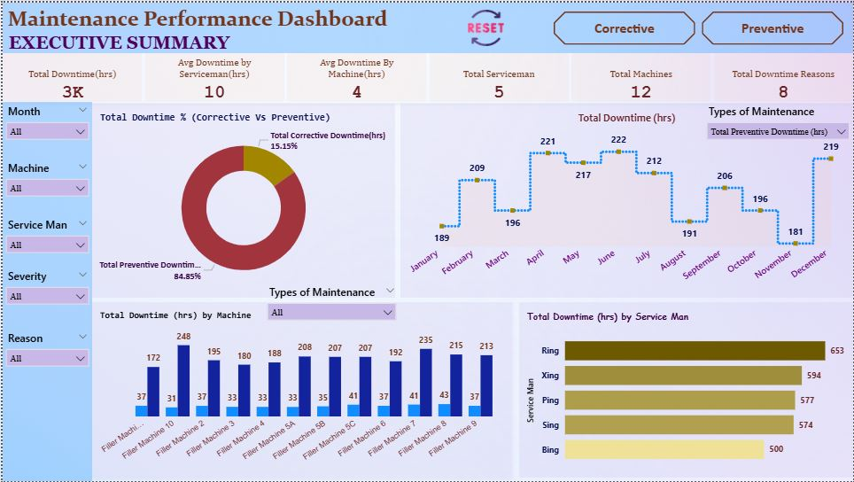

# Maintenance Performance Dashboard (Power BI)

This dashboard analyzes one year of preventive and corrective maintenance downtime data for a manufacturing plant.

## Features
- 3-page Power BI dashboard
- Slicers for machine, breakdown type, technician, reason, severity
- Preventive maintenance, corrective maintenance

## Screenshot

